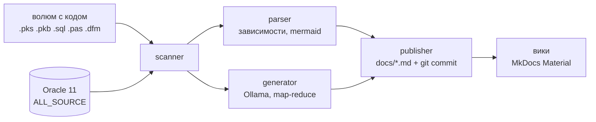

# Autodocs

[](LICENSE)
[](pyproject.toml)
[-orange.svg)](docker/autodocs.Dockerfile)

Self-hosted сервис автогенерации документации по легаси-коду (PL/SQL Oracle 11,
Delphi 7) локальной LLM на Ollama. Код не покидает контур: единственные сетевые
вызовы — локальная Ollama, Oracle и git внутри вашей инфраструктуры.

По событию (webhook) или расписанию сервис обходит источники, документирует
**только изменённые** объекты (чексуммы) и публикует markdown-страницы со схемами
зависимостей в вики (MkDocs Material).

## Как это работает



- **Большие пакеты** (15–20 тыс. строк) режутся по границам процедур и
  документируются map-reduce: описания фрагментов → сводка.
- **Схемы связей** (какие таблицы и пакеты использует объект) строятся
  статическим анализом, не LLM — в них нет галлюцинаций.
- **Инкрементальность**: неизменённые объекты пропускаются, LLM не вызывается.
- Ошибка одного объекта не прерывает проход — объект помечается ERROR,
  остальные документируются.

## Быстрый старт — docker compose

Рекомендуемый способ запуска — `docker compose`: весь стек описан в
[docker-compose.yml](docker-compose.yml), поднимается одной командой.
Нужны: Docker, Ollama с моделью (локально или по сети).

```bash
git clone git@github.com:SergeyPostnikov/wicked.git autodocs && cd autodocs

# каталоги: код проекта (read-only), вики, промпты
mkdir -p code wiki prompts

UID=$(id -u) GID=$(id -g) docker compose up -d
```

Обязателен только сервис `autodocs`; остальные включаются compose-профилями:

| Команда | Что поднимается |
|---|---|
| `docker compose up -d` | только autodocs (Ollama уже захощена у вас) |
| `docker compose --profile ollama up -d` | + контейнер Ollama (волюм моделей, опц. GPU) |
| `docker compose --profile viewer up -d` | + просмотр вики на :8000 (MkDocs Material) |
| `docker compose --profile ollama --profile viewer up -d` | весь стек |

Настройки — через `.env` рядом с `docker-compose.yml` (см. таблицу ниже);
`UID`/`GID` задают владельца файлов вики на хосте. После правки `.env` —
`docker compose up -d` перечитает конфигурацию.

Альтернативы compose: одиночный `docker run` с волюмами `-v ./code:/code:ro
-v ./wiki:/wiki -v ./prompts:/prompts` (когда Ollama внешняя и viewer не нужен)
или запуск без Docker (`uv run python -m src.main`) — но образ предпочтительнее:
в него запечён Oracle Instant Client 19c для доступа к Oracle 11.

Запустить проход вручную:

```bash
curl -X POST localhost:8080/webhook -H "X-Autodocs-Token: $WEBHOOK_SECRET"
curl localhost:8080/status   # прогресс и счётчики последнего прохода
```

Просмотр вики: профиль `viewer` → http://localhost:8000, либо любой рендер
markdown поверх каталога `wiki/` (это обычный git-репозиторий).

## Конфигурация

Все параметры — env-переменные (`.env` рядом с `docker-compose.yml`).

| Переменная | Дефолт | Что делает |
|---|---|---|
| `OLLAMA_URL` | `http://ollama:11434` | Endpoint Ollama |
| `OLLAMA_MODEL` | `qwen2.5-coder:14b` | Модель |
| `LLM_CONTEXT_TOKENS` | `8192` | Бюджет контекста — определяет размер чанка |
| `ORACLE_DSN` | — | `host:port/service`; пусто — источник отключён |
| `ORACLE_USER` / `ORACLE_PASSWORD` | — | Read-only учётка (нужен SELECT на ALL_SOURCE) |
| `ORACLE_SCHEMAS` | — | Схемы через запятую, например `APP,BILLING` |
| `SCHEDULE_CRON` | `0 3 * * *` | Расписание проходов; пусто — отключено |
| `WEBHOOK_SECRET` | — | Токен `POST /webhook`; пусто — webhook отключён |
| `MAX_RETRIES` | `3` | Ретраи retryable-ошибок LLM |
| `UID` / `GID` | `1000` | uid/gid владельца волюмов на хосте |

Oracle 11: в образ запечён Instant Client **19c** (thick mode) — последняя
ветка клиента, совместимая с сервером 11.2.

## Промпты — под вашу кодовую базу

При первом старте дефолтные промпты копируются в волюм `prompts/`; правьте их
как обычные файлы — пересборка не нужна, изменения подхватываются на следующем
проходе, затронутые страницы регенерируются.

| Файл | Когда используется |
|---|---|
| `package.md` | PL/SQL-объект, влезающий в контекст |
| `chunk.md` / `summary.md` | map-reduce для больших PL/SQL-пакетов |
| `delphi_unit.md` | модуль Delphi (.pas/.dfm) |
| `delphi_chunk.md` / `delphi_summary.md` | map-reduce для больших модулей |
| `templates/package_page.md.j2` | jinja2-скелет страницы |

Структуру вики промпты не определяют — иерархия детерминированно строится
из структуры кода (`docs/oracle/СХЕМА/ОБЪЕКТ.md`, `docs/file/путь/файл.md`).

## Разработка

```bash
uv sync                # зависимости (+dev)
uv run pytest tests/   # тесты
uv run python -m src.main  # локальный запуск (env — см. src/config.py)
```

Спецификация и user stories — ветка [`docs/spec`](../../tree/docs/spec):
`specs.yaml`, `user_stories.yaml`, `TZ.md`.

## Лицензия

Проприетарная — см. [LICENSE](LICENSE). Использование без письменного
разрешения правообладателя запрещено.
